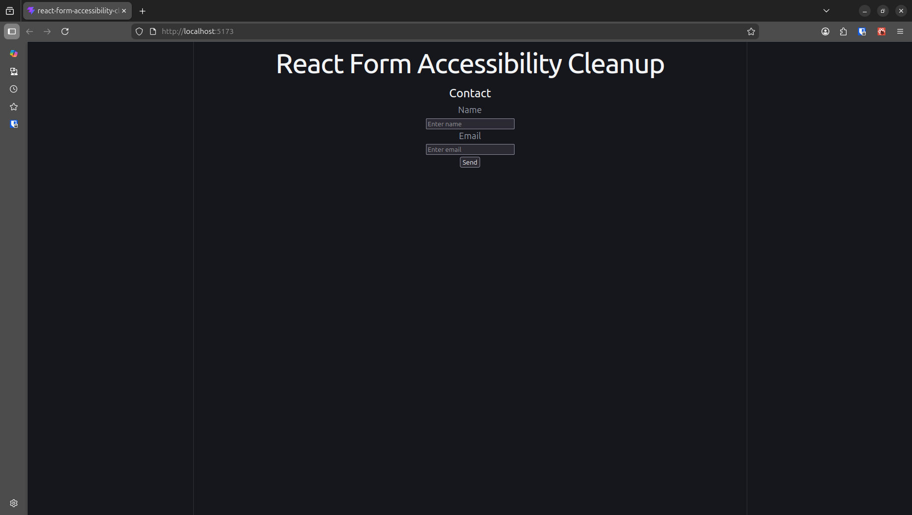
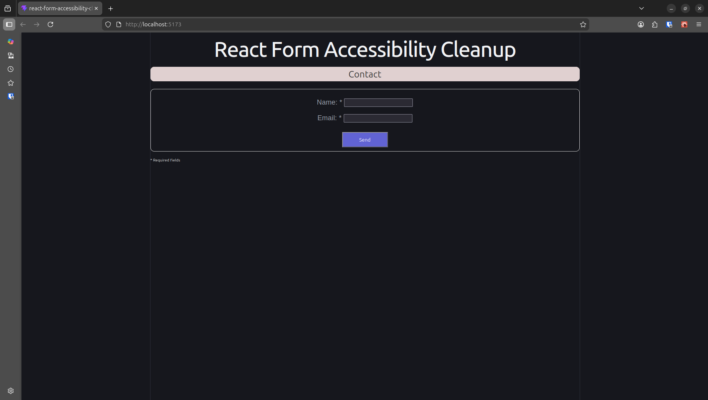
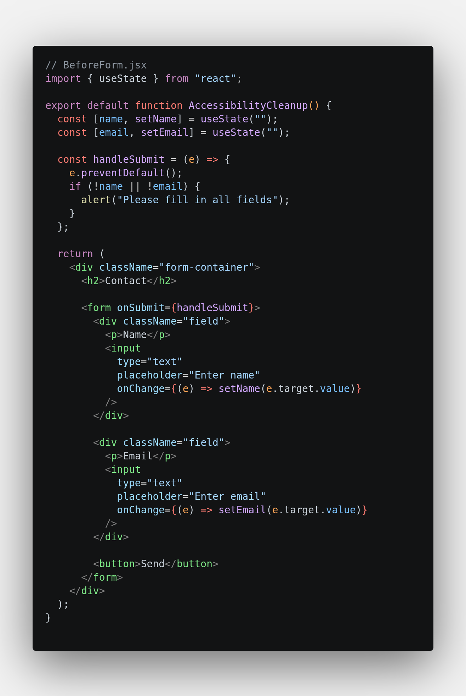
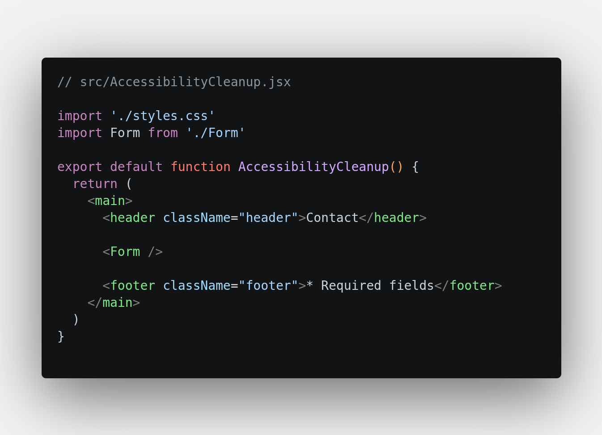
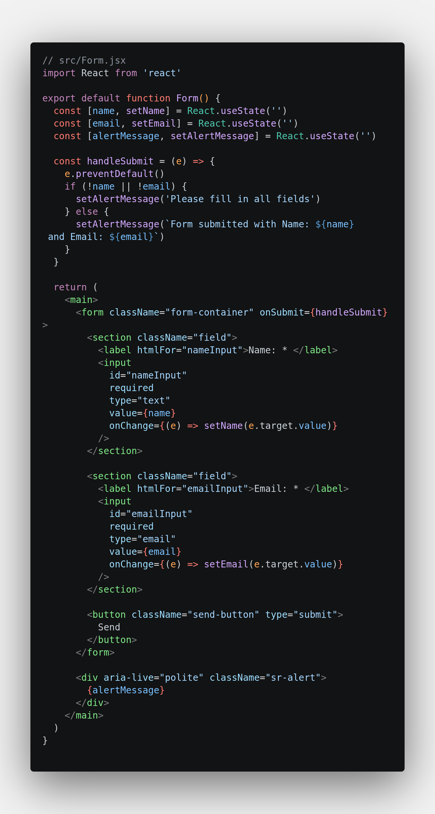
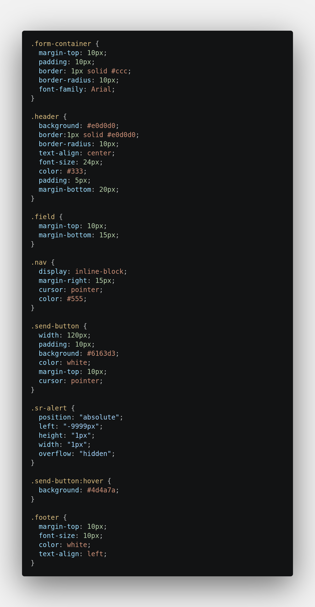

# React Cleanup Example — Before/After Refactor

This project demonstrates my ability to take an inaccessible, inconsistent React form component and refactor it into a clean, readable, fully accessible, and user‑friendly version. It highlights the type of UI cleanup, accessibility improvements, and component refactoring I deliver for clients.

---

## 🔧 What This Example Shows

- Fixing accessibility issues in form components
- Adding proper labels, roles, and semantic structure
- Improving keyboard and screen‑reader behaviour
- Cleaning up JSX and removing unnecessary markup
- Improving naming, structure, and readability
- Making UI behaviour predictable and consistent
- Demonstrating before/after improvements clearly

---

## 📁 Project Structure

```
react-form-accessibility-cleanup/
|── before/
│     ├── AccessibilityCleanup.jsx   ← original version (before)
|     └── beforeUi.png 
├── src/
│     ├── AccessibilityCleanup.jsx   ← cleaned version (after)
│     └── App.jsx
└── README.md
```

The **before** and **after** versions are kept separate so you can clearly see the improvements.

---

## ▶️ Running the Project

Install dependencies:

Start the dev server:

Install dependencies:
- npm install

Start the dev server:
- npm run dev

Then open the local URL shown in the terminal to view the component in the browser.

## 🛠 Tech Stack

- React 
- Vite 
- JavaScript (ES6+) 
- JSX

---

## 📝 Before → After Summary

### Before (AccessibilityCleanup.jsx)

- Missing or incorrect labels
- No accessible name for buttons
- No type attribute on buttons
- Missing alt text on images
- Poor semantic structure
- Inconsistent formatting
- Inline event handlers without clarity
- Hard to follow UI behaviour
- Not keyboard‑friendly
- Screen readers unable to interpret dynamic content

### After (AccessibilityCleanup.jsx)

- Correct `label + htmlFor` associations
- Added accessible names for buttons
- Added `type=\"button\"` to prevent unintended form submission
- Added meaningful alt text
- Improved semantic HTML
- Cleaner, more readable `JSX`
- Predictable behaviour and clearer logic
- Better keyboard and screen‑reader accessibility
- More maintainable and scalable component structure
- Creation of a `Form.jsx` and `Styles.css`

---

## 📸 Screenshots

- **BeforeUI screenshot**


- **AfterUI screenshot**


- **BeforeCode screenshot**


- **Minimal AccessibilityCleanup.jsx screenshot**


- **Newly created Form.jsx screenshot**


- **Newly created Styles.css screenshot**


---

## 💡 Why This Project Matters

Most real‑world frontend work isn’t building huge apps — it’s fixing:

- accessibility issues
- confusing form behaviour
- missing labels and semantics
- inconsistent JSX
- unclear logic
- poor user experience

This example shows exactly the kind of high‑impact, fast‑turnaround improvements I specialise in: making existing components cleaner, more accessible, and more maintainable.

---

## 🌐 Live Demo

View the project here:
https://katemills74-a11y.github.io/react-form-accessibility-cleanup/

## 📬 Want Something Similar?

If you need help cleaning up your React components, improving UI consistency, or fixing layout and accessibility issues, I can help. 
